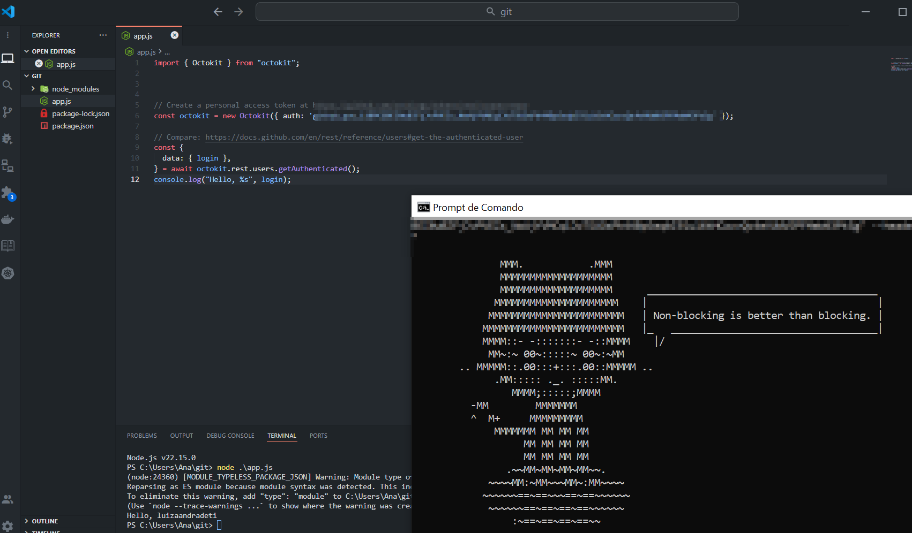

# git-api

# octokit.js


**Example**: Get the username for the authenticated user.

```js
// Create a personal access token at https://github.com/settings/tokens/new?scopes=repo
const octokit = new Octokit({ auth: `personal-access-token123` });

// Compare: https://docs.github.com/en/rest/reference/users#get-the-authenticated-user
const {
  data: { login },
} = await octokit.rest.users.getAuthenticated();
console.log("Hello, %s", login);
```

> [!CAUTION]
>  Este repo não tem relação com posts, assuntos nem com pauta nenhuma, é só um estudo pessoal



https://github.com/luizaandradeti/estudos-poc-job
[MIT](LICENSE)
